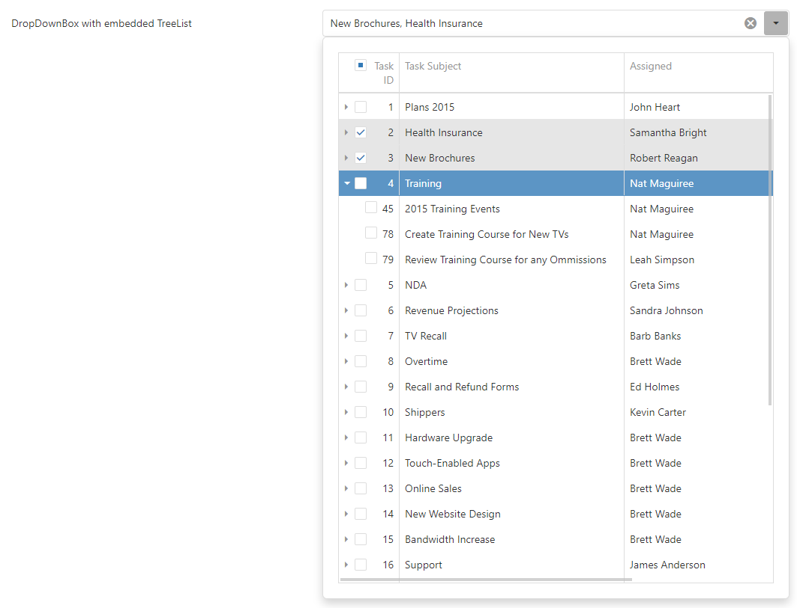

<!-- default badges list -->

<!-- default badges end -->

# DropDownBox for DevExtreme - How to implement search for TreeList

This example illustrates how to implement search for TreeList.

The search feature is implemented in the DropDownBox component's [onInput](https://js.devexpress.com/Documentation/ApiReference/UI_Components/dxDropDownBox/Configuration/#onInput) event handler. This modifies the TreeList's searchPanel [text](https://js.devexpress.com/Documentation/ApiReference/UI_Components/dxTreeList/Configuration/searchPanel/#text) property. The TreeList's [onSelectionChanged](https://js.devexpress.com/Documentation/ApiReference/UI_Components/dxTreeList/Configuration/#onSelectionChanged) event handler updates the DropDownBox's value. The keyboard navigation using the arrow down key is implemented in the DropDownBox's [onKeyDown](https://js.devexpress.com/Documentation/ApiReference/UI_Components/dxDropDownBox/Configuration/#onKeyDown) event handler.

## Files to Review

- **Angular**
    - [app.component.html](Angular/src/app/app.component.html)
    - [app.component.ts](Angular/src/app/app.component.ts)
- **jQuery**
    - [index.html](jQuery/src/index.html)
    - [index.js](jQuery/src/index.js)
- **ASP.NET**    
    - [Index.cshtml](ASP.NET/Views/Home/Index.cshtml)

## Documentation

- [Getting Started with DropDownBox](https://js.devexpress.com/Documentation/Guide/UI_Components/DropDownBox/Getting_Started_with_DropDownBox/)

- [DropDownBox - API Reference](https://js.devexpress.com/Documentation/ApiReference/UI_Components/dxDropDownBox/)
<!-- feedback -->
## Does this example address your development requirements/objectives?

 

(you will be redirected to DevExpress.com to submit your response)
<!-- feedback end -->
