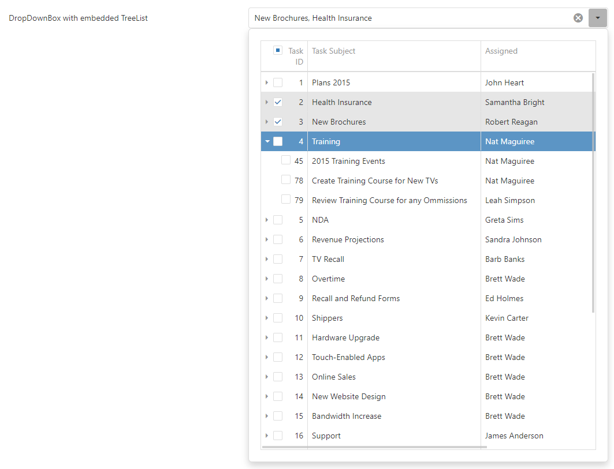

<!-- default badges list -->

<!-- default badges end -->

# DevExtreme DropDownBox - Search Within an Embedded TreeList

This repository contains code referenced in the following DevExtreme help topic: [DropDownBox - How To Search by Lookup Column (TreeList)](https://js.devexpress.com/Documentation/Guide/UI_Components/DropDownBox/Search_in_Embedded_Components/#Search_by_Lookup_Column_TreeList). 

## Files to Review

- **Angular**
    - [app.component.html](Angular/src/app/app.component.html)
    - [app.component.ts](Angular/src/app/app.component.ts)
- **jQuery**
    - [index.html](jQuery/src/index.html)
    - [index.js](jQuery/src/index.js)
    - [helpers.js](jQuery/src/helpers.js)
- **React**
    - [DropDownList.tsx](React/src/components/DropDownList/DropDownList.tsx)
    - [service.ts](React/src/service.ts)
- **Vue**
    - [DropDownList.vue](Vue/src/components/DropDownList.vue)
    - [service.ts](Vue/src/service.ts)
- **ASP.NET Core**
    - [Index.cshtml](ASP.NET%20Core/Views/Home/Index.cshtml)

## Documentation

- [Getting Started with DropDownBox](https://js.devexpress.com/Documentation/Guide/UI_Components/DropDownBox/Getting_Started_with_DropDownBox/)
- [DropDownBox - Synchronize with the Embedded Element](https://js.devexpress.com/Documentation/Guide/UI_Components/DropDownBox/Synchronize_with_the_Embedded_Element/)
- [DropDownBox - Search in Embedded Components](https://js.devexpress.com/Documentation/Guide/UI_Components/DropDownBox/Search_in_Embedded_Components/)

## More Examples

[DevExtreme DropDownBox - Search Within an Embedded DataGrid](https://github.com/DevExpress-Examples/devextreme-dropdownbox-search-in-datagrid)

<!-- feedback -->
## Does This Example Address Your Development Requirements/Objectives?

 

(you will be redirected to DevExpress.com to submit your response)
<!-- feedback end -->
